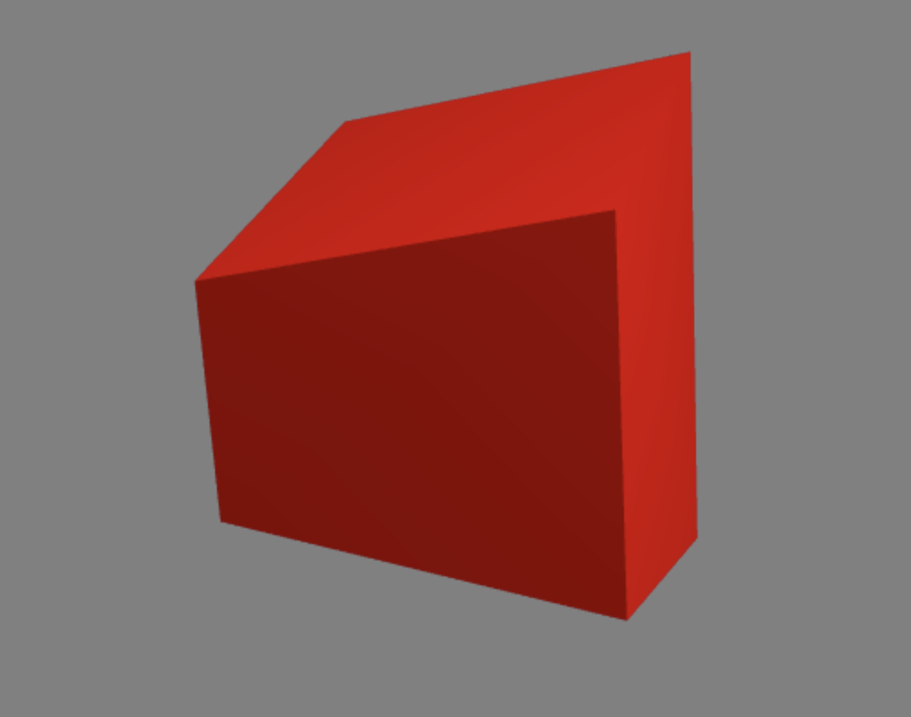
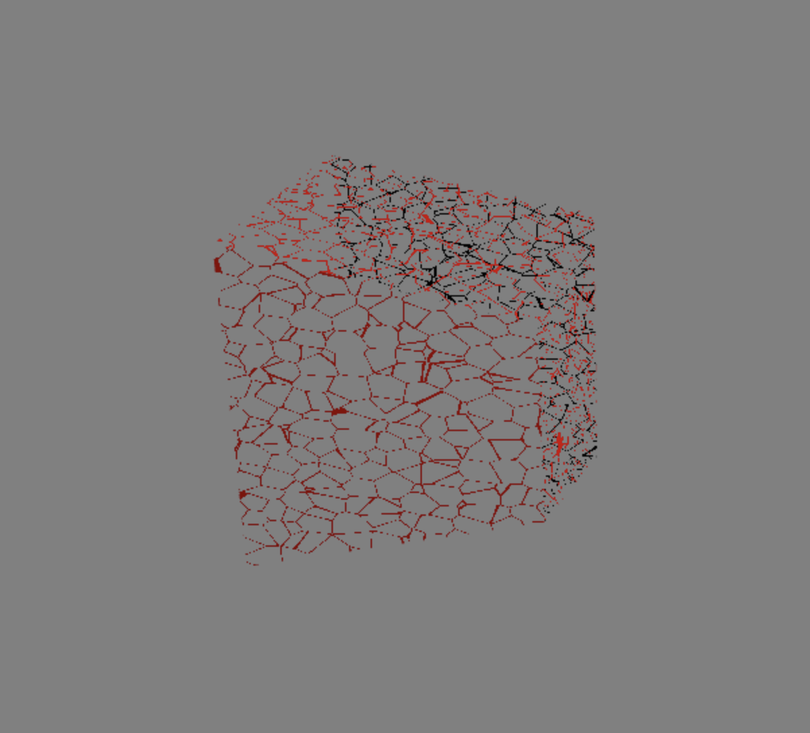

# HW 0: Intro to Javascript and WebGL

## To build and test:
`npm start` + `localhost:5660`

## To view live demo:
https://mzschwartz5.github.io/hw00-intro-base/

## Background
In this project. I demo a WebGL cube with some fancy vertex and fragment shaders.

### Vertex shader
The vertex shader applied to the cube modulates each vertex up and down (y-direction) sinusoidally. However, a phase shift is applied to each vertex modulation (derived carefully from each vert's angle in the XZ-plane), such that the overall motion is wave-like around the top and bottom faces of the cube.

### Fragment shader
The fragment shader uses 3D worley noise. By keeping track of the distances to neighboring cells, we can find the borders of the worley cells and color fragments accordingly. Using this cell border-information to control the alpha value of the fragment color, we can create a web-like framework for each surface of the cube.

